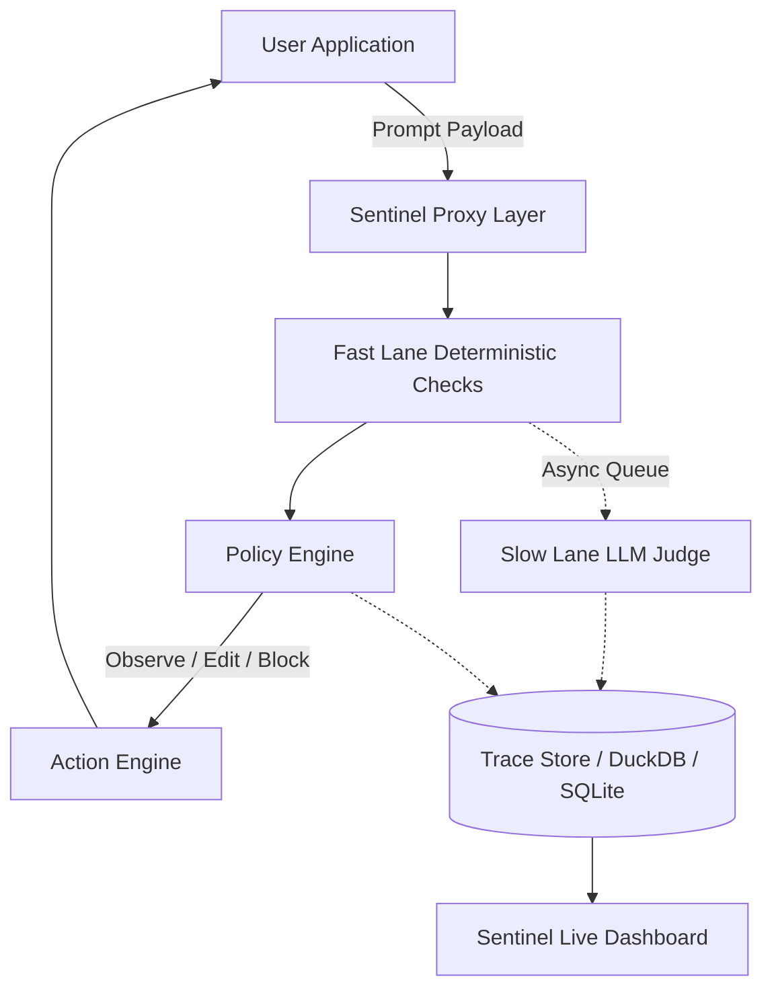

<div align="center">

# 🛡️ Sentinel 

**AI oversight is a post-mortem. We make it live.**

[](https://nextjs.org/)
[](https://fastapi.tiangolo.com/)
[](https://react.dev/)
[](https://tailwindcss.com/)
[](https://opensource.org/licenses/MIT)

*The enterprise control plane for modern AI applications. Block risks, monitor costs, and ensure compliance before the first token is generated.*

</div>

---

## ⚡ The Problem: AI operates in a Black Box
Today, when an enterprise AI assistant hallucinates an outdated refund policy or leaks PII, the workflow is entirely reactive:
1. User acts on bad data
2. Customer complains
3. Audit eventually uncovers it
4. Issue detected days later

## 🚀 The Solution: Sentinel Control Tower
**Sentinel is a model-agnostic AI oversight layer that sits between your application and any LLM.** 
It evaluates AI requests and responses, detects risks, records evidence, and takes policy-driven actions (like redacting PII or outright blocking) *before* harmful responses ever reach your users. 

### Core Capabilities

| Feature | Description |
| :--- | :--- |
| 🛡️ **Live Interventions** | Intercepts traffic to observe, edit (redact), escalate to a human, or hard-block unsafe outputs inline. |
| ⚡ **Fast & Slow Lanes** | Runs deterministic checks (PII, Secrets, Cost, Source Auth) in <50ms, while routing expensive LLM-judge checks asynchronously. |
| 💰 **Cost Optimization** | Tracks inference spend globally. Flags oversized model routing and silent retry loops to recover 12-20% of API costs. |
| ⚖️ **Responsibility & Bias** | Automatically detects outcome disparities across cohorts over a rolling window to flag systemic bias at the route level. |
| 🔎 **Audit as a Query** | Every flagged incident carries its original trace. Turning an agonizing investigation into a simple database query. |
| 🌐 **Model Agnostic** | Works on top of OpenAI, Anthropic, Meta Llama, or any in-house model. No vendor lock-in. |

---

## 🏗️ Architecture

Sentinel operates via a lightweight proxy pattern. Oversight doesn't tax the thing it oversees.



---

## 🛠️ Tech Stack
This repository contains a fully functional MVP demonstrating the power of Sentinel:
* **Frontend:** Next.js (App Router), Tailwind CSS, Framer Motion, GSAP.
* **Backend:** Python, FastAPI, SQLAlchemy, Pydantic.
* **Database:** SQLite (Easily swappable to PostgreSQL/DuckDB).

---

## 🚀 Quickstart

Get the entire Control Tower up and running locally in under 2 minutes.

### 1. Start the Interception Engine (Backend)
```bash
cd backend
python -m venv venv
# Windows: .\venv\Scripts\Activate.ps1
# Mac/Linux: source venv/bin/activate
pip install fastapi "uvicorn[standard]" sqlalchemy pydantic

# (Optional) Seed the database with 10,000+ realistic historical traces
python seed.py

# Boot the engine
uvicorn app.main:app --reload --port 8000
```

### 2. Start the Control Tower (Frontend)
```bash
cd frontend
npm install
npm run dev
```

### 3. Experience Sentinel
Navigate to `http://localhost:3000` to view the stunning Control Tower interface.

---

## 🎮 Live Demo Flow

To truly understand the power of live interception, visit the **Playground** (`http://localhost:3000/playground`) in the dashboard.

1. **The Baseline:** Try the "Safe Request" scenario to see standard routing.
2. **The Edit Action:** Try the "PII Leakage" scenario and watch Sentinel dynamically redact credit card numbers in real-time.
3. **The Block Action:** Try the "Restricted Source" scenario. Watch Sentinel detect a citation of a CONFIDENTIAL document for a user with PUBLIC clearance, instantly blocking the response and escalating it to the human review queue.

---

<div align="center">
  <i>Built for enterprise AI safety. Minutes from incident to evidence.</i>
</div>
