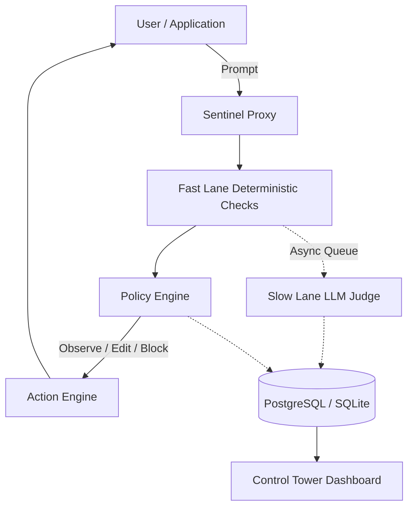

# Sentinel Control Tower MVP

**AI oversight is a post-mortem. We make it live.**

Sentinel is a model-agnostic AI oversight layer that sits between an application and any LLM/provider. It evaluates AI requests and responses, detects risks, records evidence, and takes policy-driven actions before harmful responses reach users.

## Architecture



## Features

- **Model Agnostic**: Works above any LLM provider.
- **Fast & Slow Lanes**: Synchronous regex/deterministic checks (PII, Secrets, Cost, Source Auth) + Async LLM evaluation.
- **Live Interventions**: Can redact PII or completely block unsafe/unauthorized responses inline.
- **Source Authorization**: Validates document citations against user clearance levels.

## Tech Stack
- **Frontend**: Next.js (App Router), Tailwind CSS, Recharts, Lucide Icons.
- **Backend**: FastAPI, SQLAlchemy (SQLite for demo), Pydantic.

## Local Setup

### 1. Backend Setup
```bash
cd backend
python -m venv venv
.\venv\Scripts\Activate.ps1
pip install fastapi "uvicorn[standard]" sqlalchemy pydantic
```

Run the seed script to generate 10,000+ demo traces and incidents (Already done in this environment!):
```bash
python seed.py
```

Start the FastAPI server:
```bash
uvicorn app.main:app --reload --port 8000
```

### 2. Frontend Setup
```bash
cd frontend
npm install
npm run dev
```

The Sentinel Control Tower dashboard will be available at `http://localhost:3000`.

## Demo Flow

Navigate to `http://localhost:3000/playground` to simulate live requests.
1. Try the "Safe Request" scenario.
2. Try the "PII Leakage" scenario and watch the response get EDITED.
3. Try the "Restricted Source" scenario (simulating a citation of a CONFIDENTIAL document while the user has PUBLIC clearance) and watch the response get BLOCKED and ESCALATED.
